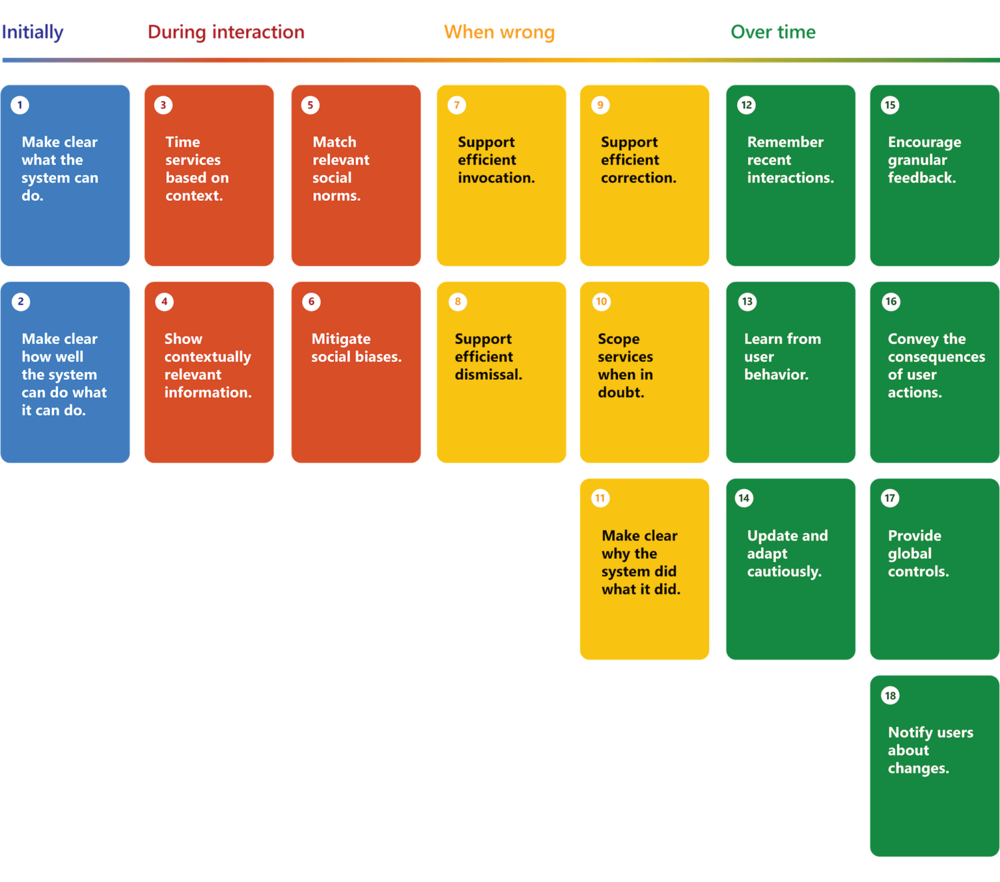

# Foundational Design and Implementation Concepts for Agentic AI Systems

## Definition

Agentic AI systems are engineered to independently pursue sophisticated objectives and workflows with minimal human guidance. These entities function as autonomous agents, capable of making decisions and executing tasks on their own. A GenAI-based agent leverages the capabilities of Large Language Models (LLMs) to comprehend instructions, engage in reasoning, and produce actionable outputs.

## Motivation

The prowess of LLMs in Natural Language Processing (NLP) tasks and creative content generation is well-documented, traditionally catering to human readers for interpretation.

However, a significant and emerging application lies in automating tasks that have been performed by humans, particularly those involving digital interfaces, ranging from transaction processing and customer support to routine office tasks. Recent breakthroughs have dramatically enhanced the utility of LLMs, including their ability to generate executable code, create well-structured data, and understand complex instructions and contexts. 

Innovations such as extended context length support and the processing of images and videos have made it feasible to develop highly effective agents for a broad spectrum of real-life applications.

These advancements catalyze the creation of GenAI agents, which are poised to automate and streamline a vast array of digital and interactive tasks previously reliant on human intervention.

## Key Scenarios

1. Technical support automation
2. Code assistance for large scale projects like code base modernization
3. Automated audits (call centers, financial transactions, etc.)
4. Complex data analysis for non-technical resources
5. e-Commerce agent driven conversions
6. ...

## Top Challenges

### Tension between automation (flexiblity) and control (adherence to processes)

The purpose of agents is to pursue complex goals with limited supervision to automate tasks, but the challenge is to ensure that the agent is not too autonomous/creative to the point where it deviates from the intended process.

This requires a balance between flexibility and control, where the agent can adapt to different scenarios while adhering to the desired process.

This is typically addressed by providing the agent with a set of rules or guidelines to follow (constrain the action space), or even by having another agent monitoring adherence to the process (accountability for the actions taken.

### Agent to agent communication and broadcasting

Defining and controlling the output of the agent is a key challenge. The agent should be able to communicate its output effectively to other agents or users, and this communication should be standardized and consistent.

Different means of communication and information retrieval are possible, depending on the complexity of the solution. This could range from simple text-based communication to more complex data exchange formats involving standardized memorization and memory retrieval.

In complex multi-agents system, a broadcasting mechanism of all the outputs/findings of agents can be considered to facilitate highly creative and collaborative solutions where feedback from one agent can be leveraged as context immediately by all other agents at their discretion.

### Scalability (number of agents): finding the right balance between separation of concerns and overhead of subtasking

One of the key scalability factor from a compute standpoint (and therefore indirectly cost and latency) is the number of agents involved in solving a complex goal.

The are benefits from a testability and robsutness standpoint in breaking down the duties of each agents into smaller roles, but this can also lead to overhead in terms of communication and coordination between agents.

Striking the right balance could be a challenge, but the more powerful LLMs enable the definition of agents which can follow relatively complex rules and guidelines, reducing the need for a large number of agents.

This is something to take into account at design time and over the entire life of the system as the evolution of tasks, LLM capabilities and performance requirements may lead to reconsider the agents involved and their role definitions.

### Ability to auto-detect unproductive plans and take corrective actions (interruptability)

As semi-autonomous systems, it is crucial to be able to evaluate and detect when an agent is not making progress towards its goal, or when it is following an unproductive path to avoid lengthy and costly execution with no valuable outcome.

Two core concepts here are to be considered, usually in a complementary fashion:
- Agents should be able to evaluate their own comprehension of the task at hand and require human clarification when unsure about the meaning of the task or the context in which it is to be executed. This is a core concept which makes 'conversational' agents more valuable then 'question/answer' bots.
- Some agents could be dedicated to a playing a critical thinking function, reviewing other agents plans and evaluating their validity before their executions. This function can be embedded in each agent themselves at the cost of more complex instructions and less robustness than a dedicated agent approach.

Another aspect of the Agentic AI System is the ability for the human to interrupt the flow of execution at any time, and provide feedback or guidance to the agent. This is a key aspect of the human-in-the-loop approach, where the human can provide context, feedback, or guidance to the agent to ensure that the task is executed correctly and rectify the course of action if needed.

### UX challenges to provide transparency, control and enable human in the loop collaboration

As stated above, great value comes from an active collaboration of the user with the agentic AI system. This requires a user experience that is transparent, provides control to the user, and enables the user to provide feedback and guidance to the system.

The transparency also alleviates one of the key UX challenge of this type of system, which is the relative low latency involved at each step. Not showcasing anything than a spinning icon is a very frustrating experience.

Transparency provides two great benefits:
- The user can understand what the system is doing and why, which can help build trust in the system and increase user satisfaction.
- The user can provide feedback and guidance to the system, which can help improve the system's performance and ensure that the task is executed correctly.

Besides providing transparency, and as stated in the previous section, the system gains from providing control points to the user. An interuptability function provided throughout the flow will enable users to guide the decision making-process when needed.

### Data access & data privacy governance

Most agents will rely on one or more sources of information to inform their reasoning and decision-making. This data can come from a variety of sources, including databases, APIs, and other agents.

It is crucial to consider the security context of the end-user (or system) triggering the original ask, to understand what the scope of data access is by this entity and enforce the established data governance in place on these systems.

In most cases, this responsility is accomplished via propagation of the requester security context down to the underlying data services.

Nevertheless, as data is being generated by these agents (for instance, in the process of memorization for consumption by other agents), special attention needs to be put in place around these memory stores to guarantee the original data governance and data privacy are respected.

### Handling memory, insights, notes to enable complex tasks within the constraints of data governance and privacy

### Learning from experience to alleviate high cost of execution 

As described earlier, a multi-agents system can involve a significant number of agent interactions (between agent and human, between agents, and between agents and external systems). This can lead to a high cost of execution, especially if the agents are not able to learn from their experience and adapt their behavior accordingly.

One way to alleviate this cost is to enable agents to learn from their experience and improve their performance over time. This can be done by providing agents with the ability to store and retrieve information from memory, enabling them to learn from past interactions and make better decisions in the future.

This is best accomplished by summarizing at the end of an interaction the key learnings and insights that were generated by the system, with special emphasis on the overall path to resolution. The idea is to store which steps lead to a succesful outcome and in which order, plus potential details as relevant to the context. This would enable further requests to look up past request and get one or more 'plans' that outline how to handle such request, and provide this as context to the system Planner to further refine the plan.

One key aspect of that is to preserve data governance and data privacy as part of storing and restoring such plans. In practice it means that data obfuscation and data anonymization should be considered as part of the memory storage process.

### Monitoring, auditing, telemetry & performance

### Cost management / budgeting

### Testability

### System safety and security

### Responsible AI

## Key Functional Building Blocks

1. Assistant / Coordinator / Dispather
2. Agent / Actor (aka Plugins, skills, specialized agents)
3. User Proxy Agent for Human Collaboration
4. Planner / Replanner / Reflection (ReAct + critical thinking)
5. Knowledge (runtime data access)
6. Memory: short-term (working/scratchpad/whiteboard), long-term (consolidated information), associative (capture meaning), semantic (definitions, rules, categories, ...), episodic (person, places, events), procedural (how to best perform a task)

## System Level Architecture and Key Functional Flows

## Practical Implementation Considerations

The framework landscape is evolving rapidly, but a few frameworks are surfacing as promising for building Agentic AI systems with a rich set of the Key Functional Building Blocks being made available. You may have to combine a few to build a full end-to-end solution based on their strenghts.

Here are some of the key frameworks to consider when building an Agentic AI systems:

| Category | Framework | Key Concepts |
| --- | --- | --- |
| Coordinator | [Autogen](https://microsoft.github.io/autogen/) | Agents (Conversable, User Proxy, Retrieval), Code Executors, Tool Executors, Memories (Teachability)|
|| [CrewAI](https://github.com/joaomdmoura/crewai) | Agents, Tasks, Tools, Processes, Crews |
|| [LangChain](https://www.langchain.com/langchain) | Agents, Chains, Retrievers, Memories, Callbacks |
|| [Semantic Kernel](https://learn.microsoft.com/en-us/semantic-kernel/overview/) | Kernels, Planners, Plugins, Memories |
|| [XAgent](https://github.com/OpenBMB/XAgent) (experimental) | Dispatchers, Planners, Actors, Tools |
| Data Access | [Kernel Memory](https://github.com/microsoft/kernel-memory) | Ingestion Pipelines (with OCR), Storage, Data Lineage, Citation, Summarization, Security Filters |
|| [LlamaIndex](https://www.llamaindex.ai/) | Loading, Indexing, Querying, Storing, Evaluating |
| Memory | [AutoGen Teachability](https://microsoft.github.io/autogen/docs/notebooks/agentchat_teachability) | Teachability
|| [LangChain Memory](https://python.langchain.com/docs/modules/memory/) | Conversation Buffer, Conversation Summary, Entity, Conversation Knowledge Graph
|| [Kernel Memory](https://github.com/microsoft/kernel-memory) | Ingestion, Storage, Data Lineage, Citation, Summarization, Security Filters, OCR, Short-Term Memory |
|| [MemGPT](https://memgpt.ai/) | Agents (memory managers), Sources, Tools, Presets, Humans, Personas |
|| [Semantic Kernel Memories](https://learn.microsoft.com/en-us/semantic-kernel/memories/) | Key-Value Memory, Local-Storage Memory, Semantic Memory |

## UX Considerations

### Guidelines for Human-AI Interaction

## Responsible AI Considerations

### Responsible AI Principles

[The Microsoft Responsible AI Principles](https://query.prod.cms.rt.microsoft.com/cms/api/am/binary/RE5cmFl?culture=en-us&country=us) are a set of guidelines that Microsoft uses to ensure that AI systems are designed and implemented in a responsible manner. These principles are:

1. Fairness: AI systems should treat all people fairly.
2. Reliability and safety: AI systems should perform reliably and safely.
3. Privacy and security: AI systems should be secure and respect privacy.
4. Inclusiveness: AI systems should empower everyone and engage people.
5. Transparency: AI systems should be understandable.
6. Accountability: People should be accountable for AI systems.

### Responsible AI Frameworks and Tools

TODO

### Integrating Responsible AI Principles into the Design and Implementation of Agentic AI Systems

TODO