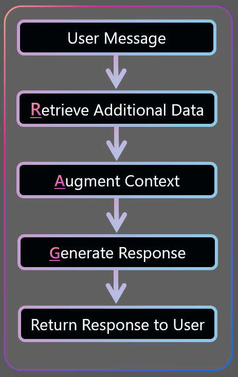

# Retrieval Augmented Generation (RAG)

## What is Retrieval Augmented Generation (RAG)?

Retrieval Augmented Generation (RAG) is a technique that enhances the capabilities of Large Language Models (LLMs) by incorporating an external information retrieval system to provide additional context. This method allows the LLM to generate responses based on a broader set of data beyond its initial training set.

If a call to an LLM were visualized like this:

  

Then Retrieval Augmented Generation (RAG), in its most simple and linear form, would looke like this:

  

## Why would you use the Retrieval Augmented Generation (RAG) Approach?

Large Language Models (LLMs), or Foundation(al) Models as they may be known, are powerful and capable without any training or fine-tuning involved. However, they are limited based on the data used to train the model. The LLM necessarily has a training cut-off date AND will not have had proprietary information to train upon regardless of date. So how does one navigate around this data problem? One method is to provide the LLM the proper data, or context, in a just-in-time manner - which is to say: **R**etrieving the proper data just in time to **A**ugment the prompt prior to the **G**eneration of the final response.

## Where does the RAG pattern have problems?

There are, at the time of publishing, four (4) potential pitfalls one might encounter when trying to perfect the RAG pattern. Each will be presented in light of trying to create a RAG pattern system for helping users reset their passwords. Here is the [source data](https://support.microsoft.com/en-us/account-billing/reset-your-work-or-school-password-using-security-info-23dde81f-08bb-4776-ba72-e6b72b9dda9e) for the examples contained below.

1. Rigid chunking of source data
2. Multi-modal source data
3. Multi-query and multi-step processes
4. Massive context; long-running discussions; scenarios requiring "memory"

## Solution Pattern for Rigid Chunking

NOTE (delete this note in your pattern document)

This section describes the pattern in details. Please use architecture diagrams, pseudo code, and other visual aids to help explain the pattern. The code provided should only be snippets if they help to articulate a concept. The goal is to provide a clear understanding of the pattern and how it can be implemented.

Solution accelerators in a different section will make references to these patterns and provide full code turn key solutions. This document focuses on the how and why.

#### <u>Approach & Architecture Overview</u>

Describe the overall approach:
- components involved
- key data structures
- key data sources and data flow
- key algorithms and techniques

Summarize with an overall architecture diagram (or more than one if needed).

Articulate potential options in the design depending on potential variability of the requirements, or if multiple approaches are viable.

Please provide pros/cons of each alternate approach if you're proposing multiple options.

Include architecture diagrams in 'assets' directory as needed to illustrate the approach.

#### <u>Implementation Details</u>

This should not be a fully working implementation, but should provide enough information to understand the approach. The only purpose of the code is to illustrate concepts.

Consider python notebooks if it helps to illustrate the approach, but blocks of pseudo code are sufficient.

Place the code in 'src' directory and reference it here.

#### <u>Performance & Scalability Considerations</u>

Discuss / evaluate the performance of the approach (accuracy, speed, etc.)
Can this solution scale to large data sets or user bases? How would you acccomplish that? Techniques and considerations. This could point out to part of the architecture and articulate how these pieces can scale.

#### <u>Testability and Evaluation</u>

Does the design approach enable a robust testing strategy?
How would you break the overall solutions into testable components?
What are the key metrics to evaluate the performance of the solution?
What frameworks / approaches would you consider to have in place for a robust test strategy?

#### <u>Observability and Monitoring</u>

How can you monitor the performance of the solution? What are the key metrics to monitor? What are the key logs to monitor? What are the key alerts to set up?

Think about what it takes to run this solution in production. Validate that the architecture takes these parameters into account.

#### <u>Responsible AI & UX Considerations</u>

what aspects of the Responsible AI Principles are relevant to this pattern? How are they addressed?

What UX considerations should be in place to ensure the solution is usable, trusted and useful? Does the underlying architecture enable to deliver on these UX considerations?

#### <u>Known Limitations</u>

When does this approach fails or is not recommended?
Are they some clear limitations to this approach? What are the trade-offs?