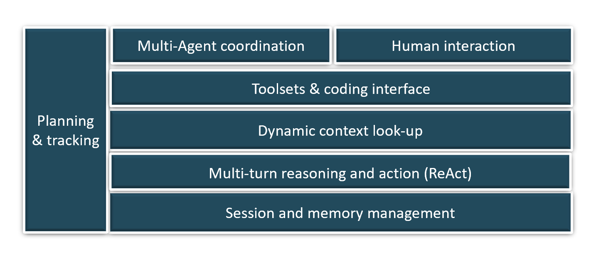
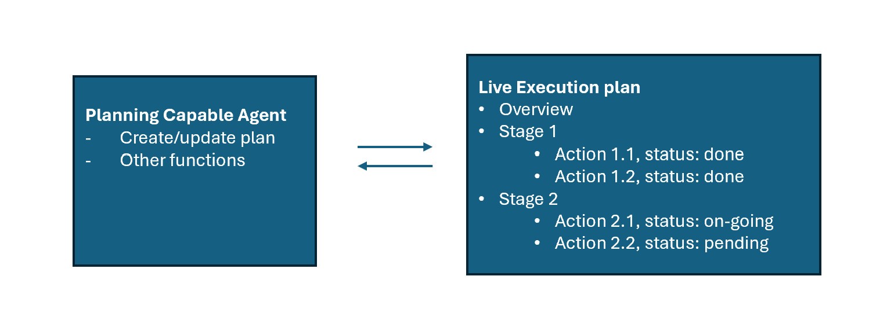
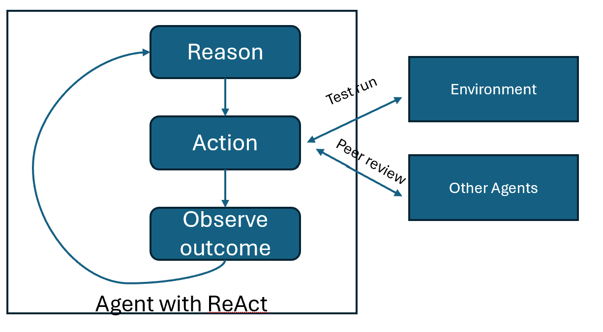
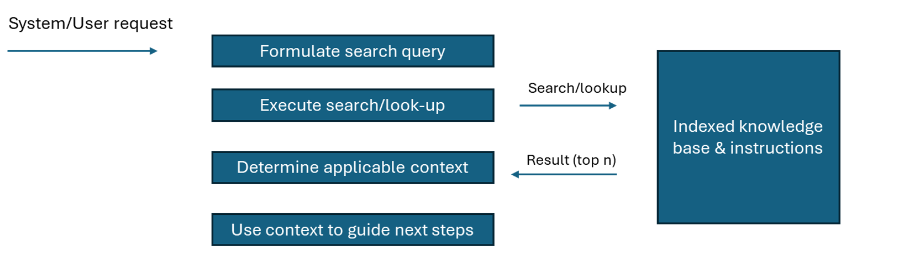
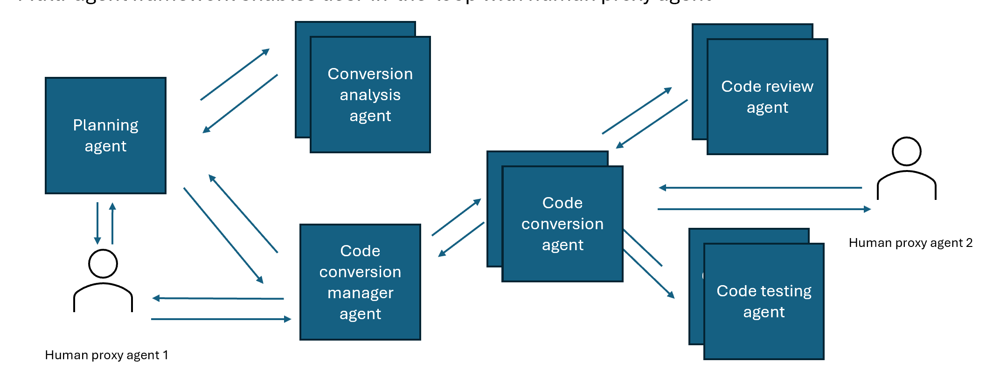

# Code Generation Agent Design Pattern  
  
## Overview  
  
The **Code Generation Agent Design Pattern** focuses on best practices and designs for implementing scenarios where the agent generates complex code. This code addresses practical business scenarios and operates within a custom environment, interacting with users, other systems, and data sources.  
  
## Typical use cases  
  
Code Generation Agents find application in a multitude of scenarios where automation of coding tasks can significantly boost efficiency and accuracy. These include:  
  
1. **Data Query Agents**: These agents specialize in extracting data from databases to respond to complex business inquiries. By generating precise query scripts, they streamline data retrieval processes, enabling faster decision-making.  
2. **Data Analysis Agents**: Leveraging languages such as Python, these agents autonomously write and execute code to analyze large datasets. They provide insights and answers to analytical questions, facilitating data-driven strategies in organizations.  
3. **Simulation Agents**: By crafting code that models experiments or simulations on digital platforms, these agents assist researchers and engineers in testing hypotheses and designs under controlled virtual conditions, saving time and resources.  
4. **Code Migration AI Assistants**: These agents are invaluable in modernizing legacy systems, automatically translating outdated codebases into modern programming languages or frameworks, thus ensuring software longevity and compatibility.  
  
## Challenges in implementing code generation agents  
  
### Company/domain specific contextual information which LLM was not trained on  
  
When users within a specific industry or company interact with an intelligent agent, they often assume that the agent possesses a deep understanding of their specific domain. This includes familiarity with specialized terminology, business metrics, and entities such as product names or business units. However, a significant challenge arises because large language models (LLMs), which power these intelligent agents, are typically trained on broad, general datasets. These models thus lack the specialized knowledge that is intrinsic to particular domains or companies.  
  
This discrepancy can lead to misunderstandings or inaccurate responses from the agent, as it may not interpret the domain-specific references correctly. For example, the term "pipeline" might be understood by the model in a general sense, but in a business context, it could specifically refer to sales pipeline, which has a completely different implication.  
  
### Managing the Complexity and Volume of Contextual Information  
  
To generate useful code, a GenAI agent needs to fully understand the context, which includes complex details like system API specifications, data structures, and organizational rules. However, the challenge is that in real-world applications, the context can become very large and complex, sometimes beyond what many large language models (LLMs) can handle. When the context is too long, it can also reduce the accuracy of the model's outputs. Therefore, it's important to find ways to help the agent manage and use a lot of contextual information effectively without losing accuracy.  
  
### Generating Accurate Code Without Extensive Testing and Trial Environments  
  
When developing code, humans leverage their senses and manual skills, utilizing techniques like printing debug messages, visualizing outputs, and iteratively refining based on observed results during debugging and testing. In contrast, a code-writing agent operates in a constrained 'expert mode' environment where it must solve problems without the same level of observability that humans have. Unlike human programmers, the agent lacks the ability to test its code across multiple environments to ensure quality before deployment. This limitation poses a significant challenge in ensuring the accuracy and reliability of the code generated by the agent.  
  
### Long session & multi-step execution  
  
During a conversation, a user may engage in a lengthy dialogue with an agent, involving discussions and clarifications of user intent, or executing multiple requests. Some of these requests might be part of a process aimed at discovering a final outcome. Additionally, the agent may need to perform multiple computational steps to gather the necessary information to resolve a task and to verify its interim findings with users.  
  
This scenario creates several challenges, including the need to maintain session information that extends beyond mere conversation history. This information might also encompass programming and data objects, interim code programs, and the reuse of these elements to achieve more comprehensive steps. The longer and more complex the state information, the more challenging it becomes for the LLM alone to track it all. This could lead to memory overflow and a decrease in the reasoning capabilities of the LLM.  
  
### Integration with Proprietary Libraries or Languages  
  
Many tasks may necessitate the use of specialized libraries or programming languages that are not commonly supported by pre-trained language models. The volume of information pertaining to these custom libraries and domain-specific languages can be extensive, often exceeding the simple contextual limits of an LLM. Moreover, documentation on how to effectively utilize these proprietary tools is frequently incomplete or unavailable.  
  
### Security Risk Management  
  
Allowing an LLM agent to write code introduces significant security risks. Malicious actors could exploit vulnerabilities in the LLM's design to generate harmful code, potentially damaging business operations and exposing sensitive information. This necessitates robust security measures to prevent and mitigate such risks.  
  
### Managing Complex Data Within a Session  
  
Throughout a session, an agent's interactions with users and external systems can produce complex and large sets of data. This could range from structured information gathered from queries to the outcomes of API calls, which may be crucial for subsequent steps. The challenge lies in efficiently managing these data objects during the session, ensuring the agent can effectively track and utilize this information as needed to progress towards the session's goals.  
  
## Solution Pattern  
  

  
### Planning and tracking  

- For long running & complex task, agents can get lost during execution  
- Key points:  
  - Equip agents (e.g. code conversion manager) with planning capability to create plan, follow-plan, and update execution status along execution  
  - Agent with plan will follow complex instruction better and with accuracy  
  
### Session and Memory Management  
  
- **Managing Complex Data Objects & Agent's Memory**  
- **Key Points:**  
  - The application platform should possess robust, stateful memory management capabilities to maintain complex data objects throughout the session.  
  - Given the limitations of an agent's memory, several useful techniques can be employed:  
    - Maintain detailed memory for the current step, including conversation specifics and details of function calls.  
    - For a set number (x) of recent conversation turns, retain only the messages exchanged between the assistant and the user, while omitting technical history such as function call details.  
    - For older history, consider either removing it or providing a summarized version.  

### Multi-step reasoning and action  

- For complex activities such as writing code, the final product may need to undergo multiple rounds of testing and reviewing, each of which may generate useful feedback to improve in the next try.  
- Key points:  
  - The agent should be designed to handle “reason -> action -> observe -> repeat” flow  
  - Communication loop happen in self-feedback mode or with another agent.  
  - Use of OpenAI’s function calling to implement actions  
  
### Dynamic context look-up  

- Contexts such as reference libraries can contain large amounts of information for multiple scenarios. Agents should be designed with look-up capability to retrieve just enough context for the current scenario.  
- Key points:  
  - Entire context information is not preloaded to Agent’s LLM prompt. Instead, it is organized into topics with indexing applied for efficient retrieval.  
  - Agents to have a search/retrieval function to look-up the context on its own to guide its actions for each scenario  
  
### Toolsets & coding interface  

### Multi-agent coordination  

- Agent’s action outcome quality can be better, especially for complex tasks such as coding, if it’s performed collectively by specialist agents.  
- Key points:  
  - Agents can perform better if they are specialists, each focusing on a particular area of expertise.  
  - Multi-agent framework enables user-in-the-loop with human proxy agent  
  
### Human interaction  
  
### System Level Architecture  
  
### Performance & Scalability Considerations  
  
### SECURITY  
  
### Testability and Evaluation  
  
### Reference Implementation  
  
- A reference implementation of Analytic AI Assistant with AutoGen  
