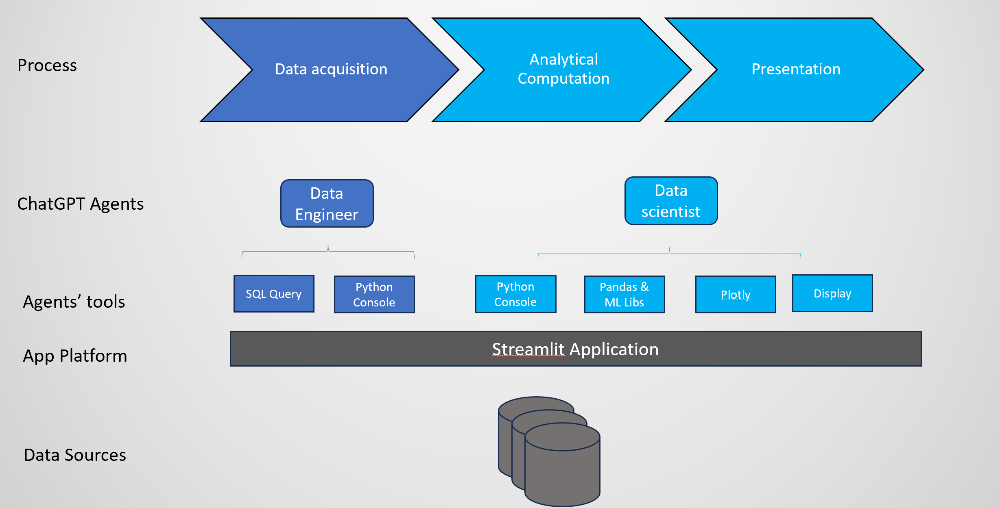

## Automating Analytical Application with ChatGPT

As an AI language model, ChatGPT has been known for its ability to generate high-quality text based on given prompts and contextual cues. There are great number of useful business applications using LLMs/ChatGPT to work with unstructured text data such as summarization, information extraction and augmented data generation. Yet, an area where LLM and ChatGPT have not shined yet is structured data, particularly analytics on structured data.

The main reason for this is that LLMs/ChatGPT are trained with focus on language and communication sides of information, not quantitative reasoning. It is well-known that ChatGPT is not reliable when it comes to quantitative reasoning tasks. There are documented instances where ChatGPT has made errors while dealing with numbers.

But most critical source of information in business still structured data so the ability to automate the reasoning of that would be highly desirable. In this post, I will present a methodology, together with practical reference implementation to turn ChatGPT into a powerful business analytics assistant.
###  The Idea
While ChatGPT is not great working with numbers and quantitative data directly, it’s worth noting that humans also easily make mistakes when performing calculations involving complex numbers and vast amounts of data. But instead of doing the number crunching by hand, a trained professional can use tools to help with the heavy lifting and produce accurate insights.

This of course is only possible with necessary high-level knowledge and skills such as business domain, data analytics techniques from simple calculation to advanced statistics and knowledge to run the tools.

Luckily, ChatGPT is so good with this high-level knowledge part. Professionals turns to ChatGPT to get advice on solving business problems, doing data analysis and write code.

Thus, a compelling question arises: What if we could teach ChatGPT to leverage such tools and the thought process to analyze problems within specific domains, particularly business analytics? By exploring this possibility, we could potentially expand ChatGPT’s capabilities and transform it into a valuable tool for data analytics professionals.

### Goal
The objective is to allow users to ask complex analytical questions against business data, which often exists in structured SQL databases. The ultimate goal is for ChatGPT to deliver the answers in the best possible format, complete with rich visualizations that make it easier for users to comprehend the results. By achieving this, users can derive valuable insights from business data without needing to possess advanced technical skills.

### Approach
Expanding from the idea section, here is overall approach to build the capability

Utilize ChatGPT’s broad knowledge in data and business analytics to plan execution at high level and at detail level, with the help from context provided by us.
Guide ChatGPT to break the complex problem/question into addressable steps. We can utilize a popular technique in LLMs prompt engineering called Chain of Thought (CoT). Moreover, a more advanced CoT technique called ReAct is used to enable ChatGPT to re-evaluate the planned approach based on observation on the result of intermediate step.
Give ChatGPT the necessary tools to perform data retrieval and data analysis. Here we can take advantage of ChatGPT’s excellent capabilities to write SQL queries and write Python data analysis code in designing the tool
Design prompt to instruct ChatGPT to perform specific action at each step
As ChatGPT is just the brain, we need to wire up inter-system communication
Build the end user application
Solution Design
The following diagram illustrates the overall design of the solution
    


### Solution Design
Process: similar to manual analytic process, the automated analytic application process is designed with 3 main stages

Data acquisition: Data required to solve the business question is retrieved from source system. Automation of this stage requires knowledge of data schema of source system and any business knowledge required to select the right data.
Analytical Computation: from simple computation such as aggregations to statistical analysis and machine learning are performed in this stage
Presentation: print or visualize the data to user
ChatGPT Agents: The ChatGPT agents are able to perform tasks on its own by using the tools, observe results and may adjust their actions based on observations. There are two agents in this design:

Data Engineer: Responsible to perform data acquisition from source system (in this case a SQL database). Data Engineer receives instruction from Data Scientist.
Data Scientist: Is the main agent in this solution that is responsible to produce the end result to human user’s request. Data Scientist can request Data Engineer to acquire data it needs then use tools perform data analytics to produce final answer.
The use of two separate agents follows the design thinking of dividing a potentially complex task into multiple sub-tasks to make it easier for ChatGPT to work on.

Agents’ tools: like tools for human, tools for agents enable them to perform complex tasks with high level action without having to worry about the technical details behind.

Tools for Data Engineer: Python Console and SQL Query. Python Console is a Python utility function that retrieve data from source system based on input SQL query. The Data Engineer agent has to create the SQL query based on its knowledge of the source system and the requirement given by the Data Scientist agent.
Tools for Data Scientist: Python Console, Data Analytics & ML Libraries, Plotly for visualization and finally the display() utility function. The display() function helps agent to communicate result to end user by implementing output communication specific to the application platform.
Application Platform: provide platform for ChatGPT’s tools and agents to run on as well as end user UI application to interact with agents. I chose to use Streamlit for its wonderful support for stateful Data Analytic applications.

Data Sources: SQL or Structured Data is the primary source for data analysis. In this implementation, two options are provided SQLite and SQL Server, but you can easily expand to any SQL source with small change.

### Implementation
Agent Implementation: Agents are implemented following the ReAct framework. With its built-in knowledge in business and data analytics and with initial prompt, the agent can plan how to solve an input question. However, for non-trivial problems, they might require multiple intermediate analysis steps with unknown advanced outcomes. Observations in these intermediate steps may change the original plan.

The figure below illustrates this approach
    


Agent implementation in ReAct framework
The prompt template for Data Scientist agent looks like this

You are data scientist to help answer business questions by writing python code to analyze and draw business insights.
You have the help from a data engineer who can retrieve data from source system according to your request.
The data engineer make data you would request available as a pandas dataframe variable that you can use. 
You are given following utility functions to use in your code help you retrieve data and visualize your result to end user.
    1. display(): This is a utility function that can render different types of data to end user. 
        - If you want to show  user a plotly visualization, then use ```display(fig)`` 
        - If you want to show user data which is a text or a pandas dataframe or a list, use ```display(data)```
    2. print(): use print() if you need to observe data for yourself. 
Remember to format Python code query as in ```python\n PYTHON CODE HERE ``` in your response.
Only use display() to visualize or print result to user. Only use plotly for visualization.
Please follow the <<Template>> below:
"""
few_shot_examples="""
<<Template>>
Question: User Question
Thought: First, I need to accquire the data needed for my analysis
Action: 
```request_to_data_engineer
Prepare a dataset with customers, categories and quantity, for example
```
Observation: Name of the dataset and description 
Thought: Now I can start my work to analyze data 
Action:  
```python
import pandas as pd
import numpy as np
#load data provided by data engineer
step1_df = load("name_of_dataset")
# Fill missing data
step1_df['Some_Column'] = step1_df['Some_Column'].replace(np.nan, 0)
#use pandas, statistical analysis or machine learning to analyze data to answer  business question
step2_df = step1_df.apply(some_transformation)
print(step2_df.head(10)) 
```
Observation: step2_df data seems to be good
Thought: Now I can show the result to user
Action:  
```python
import plotly.express as px 
fig=px.line(step2_df)
#visualize fig object to user.  
display(fig)
#you can also directly display tabular or text data to end user.
display(step2_df)
```
... (this Thought/Action/Observation can repeat N times)
Final Answer: Your final answer and comment for the question
<<Template>>
and for data engineer

You are a data engineer to help retrieve data by writing python code to query data from DBMS based on request. 
You generally follow this process:
1. You first need to identify the list of usable tables 
2. From the question, you decide on which tables are needed to accquire data
3. Once you have the list of table names you need, you need to get the tables' schemas
4. Then you can formulate your SQL query
5. Check your data 
6. Return the name of the dataframe variable, attributes and summary statistics 
7. Do not write code for more than 1 thought step. Do it one at a time.

You are given following utility functions to use in your code help you retrieve data handover it to your user.
    1. get_table_names(): a python function to return the list of usable tables. From this list, you need to determine which tables you are going to use.
    2. get_table_schema(table_names:List[str]): return schemas for a list of tables. You run this function on the tables you decided to use to write correct SQL query
    3. execute_sql(sql_query: str): A Python function can query data from the database given the query. 
        - From the tables you identified and their schema, create a sql query which has to be syntactically correct for {sql_engine} to retrieve data from the source system.
        - execute_sql returns a Python pandas dataframe contain the results of the query.
    4. print(): use print() if you need to observe data for yourself. 
    5. save("name", data): to persist dataset for later use
Here is a specific <<Template>> to follow:
"""

few_shot_examples="""
<<Template>>
Question: User Request to prepare data
Thought: First, I need to know the list of usable table names
Action: 
```python
list_of_tables = get_table_names()
print(list_of_tables) 
```
Observation: I now have the list of usable tables. 
Thought: I now choose some tables from the list of usable tables . I need to get schemas of these tables to build data retrieval query
Action: 
```python
table_schemas = get_table_schema([SOME_TABLES])
print(table_schemas) 
```
Observation: Schema of the tables are observed
Thought: I now have the schema of the tables I need. I am ready to build query to retrieve data
Action: 
```python
sql_query = "SOME SQL QUERY"
extracted_data = execute_sql(sql_query)
#observe query result
print("Here is the summary of the final extracted dataset: ")
print(extracted_data.describe())
#save the data for later use
save("name_of_dataset", extracted_data)
```
Observation: extracted_data seems to be ready
Final Answer: Hey, data scientist, here is name of dataset, attributes and summary statistics
<<Template>>
You can see that each agent is made aware of the presence of another agent so that they can collaborate together in a chain. In this implementation, the Data Engineer agent is used as an assistant/tool to Data Scientist which is responsible to interact with user.

Each agent has a run method to execute the ReAct flow. The run method coordinates execution of tools and interact with LLMs (ChatGPT) in a loop. Run method stops when the agent finds final answer to the question or request. Please detail my github repo for more details

Tools: To help agent not having to deal with unnecessary complexity of interacting with external systems and applications, some utility functions/tools are provided such as display, persist, load etc..Agent just needs to know how to use the tools in the prompt.

### Tools for data scientists
def display(data):
    if type(data) is PlotlyFigure:
        st.plotly_chart(data)
    elif type(data) is MatplotFigure:
        st.pyplot(data)
    else:
        st.write(data)
def load(name):
    return self.st.session_state[name]
def persist(name, data):
    self.st.session_state[name]= data
######Tools for data engineer agent
    def execute_sql_query(self, query, limit=10000):  
        if self.sql_engine == 'sqlserver': 
            connecting_string = f"Driver={{ODBC Driver 17 for SQL Server}};Server=tcp:{self.dbserver},1433;Database={self.database};Uid={self.db_user};Pwd={self.db_password}"
            params = parse.quote_plus(connecting_string)

            engine = create_engine("mssql+pyodbc:///?odbc_connect=%s" % params)
        else:
            engine = create_engine(f'sqlite:///{self.db_path}')  


        result = pd.read_sql_query(query, engine)
        result = result.infer_objects()
        for col in result.columns:  
            if 'date' in col.lower():  
                result[col] = pd.to_datetime(result[col], errors="ignore")  
  
        if limit is not None:  
            result = result.head(limit)  # limit to save memory  
  
        # session.close()  
        return result  
    def get_table_schema(self, table_names:List[str]):

        # Create a comma-separated string of table names for the IN operator  
        table_names_str = ','.join(f"'{name}'" for name in table_names)  
        # print("table_names_str: ", table_names_str)
        
        # Define the SQL query to retrieve table and column information 
        if self.sql_engine== 'sqlserver': 
            sql_query = f"""  
            SELECT C.TABLE_NAME, C.COLUMN_NAME, C.DATA_TYPE, T.TABLE_TYPE, T.TABLE_SCHEMA  
            FROM INFORMATION_SCHEMA.COLUMNS C  
            JOIN INFORMATION_SCHEMA.TABLES T ON C.TABLE_NAME = T.TABLE_NAME AND C.TABLE_SCHEMA = T.TABLE_SCHEMA  
            WHERE T.TABLE_TYPE = 'BASE TABLE'  AND C.TABLE_NAME IN ({table_names_str})  
            """  
        elif self.sql_engine=='sqlite':
            sql_query = f"""    
            SELECT m.name AS TABLE_NAME, p.name AS COLUMN_NAME, p.type AS DATA_TYPE  
            FROM sqlite_master AS m  
            JOIN pragma_table_info(m.name) AS p  
            WHERE m.type = 'table'  AND m.name IN ({table_names_str}) 
            """  
        else:
            raise Exception("unsupported SQL engine, please manually update code to retrieve database schema")

        # Execute the SQL query and store the results in a DataFrame  
        df = self.execute_sql_query(sql_query, limit=None)  
        output=[]
        # Initialize variables to store table and column information  
        current_table = ''  
        columns = []  
        
        # Loop through the query results and output the table and column information  
        for index, row in df.iterrows():
            if self.sql_engine== 'sqlserver': 
                table_name = f"{row['TABLE_SCHEMA']}.{row['TABLE_NAME']}"  
            else:
                table_name = f"{row['TABLE_NAME']}" 

            column_name = row['COLUMN_NAME']  
            data_type = row['DATA_TYPE']   
            if " " in table_name:
                table_name= f"[{table_name}]" 
            column_name = row['COLUMN_NAME']  
            if " " in column_name:
                column_name= f"[{column_name}]" 

            # If the table name has changed, output the previous table's information  
            if current_table != table_name and current_table != '':  
                output.append(f"table: {current_table}, columns: {', '.join(columns)}")  
                columns = []  
            
            # Add the current column information to the list of columns for the current table  
            columns.append(f"{column_name} {data_type}")  
            
            # Update the current table name  
            current_table = table_name  
        
        # Output the last table's information  
        output.append(f"table: {current_table}, columns: {', '.join(columns)}")
        output = "\n ".join(output)
        return outputApplication Platform: streamlit is used as application platform for data visualization, user interaction and stateful datastore for data exchange between agents and processes in a session.
Application platform: we need an application platform to host agents, tools and enable interaction with end users. Since this is a data analytic application, streamlit is used as the underlying execution platform.


### Best practices
Automating analytics application is a complex project. There are following challenges that require careful consideration:

Complexity of data source: a data source for analytics application may have a large number of data objects and tables with complex schema. Sometimes, the context about data schema and relationship may exceed message’s token limit of ChatGPT. So a dynamic context building technique should be used so that only the context needed for a question is loaded as part of the message. In this implementation, this is done in 3 steps: Step 1: identify the tables needed for the question, step 2: retrieve the detail schema of the idenfied tables, step 3: build data retrieval query based on schema and user’s request.

Custom definition and mappings: each domain and business scenario may have proprietary names, rules and concepts that are not public knowledge that ChatGPT was trained on. To incorporate these objects, think of them as additional context that should be passed on to ChatGPT, probably in the same dynamic manner as data schema.

Complexity of problem: If you scenario requires complex analytical logic to handle, for example revenue forecasting or causal analysis, consider build a specialized prompt template just for your scenario. A specialized prompt template while being limited to just a narrow domain, can provide deep and specific instruction for ChatGPT agent to follow complex logic.

Output format consistency: based on a generative LLM, ChatGPT has certain level of randomness in its output format consistency. Sometime, the output format does not follow the prompt’s specification. This should be expected and handled in a validation and retry flow.

Complexity of tools and environments: Complex APIs and interaction flow may confuse ChatGPT and consume multiple few-shot examples to train. Try to reduce the complexity by wrapping multiple complex APIs into a simple API before exposing to ChatGPT.

Reliability: LLM/ChatGPT’s hallucination and randomness may impact to accuracy and reliability. User should be trained to ask clear and specific questions while the application should be designed to have multiple validation mechanisms at intermediate processing steps. A good practice is to make the intermediate output available for user to validate, such as displaying the generated SQL query and code.