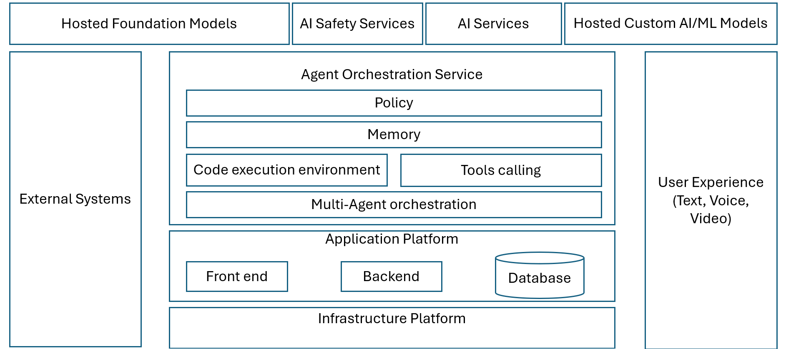
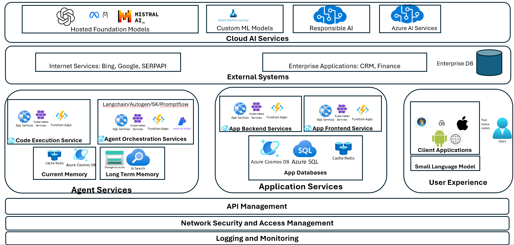
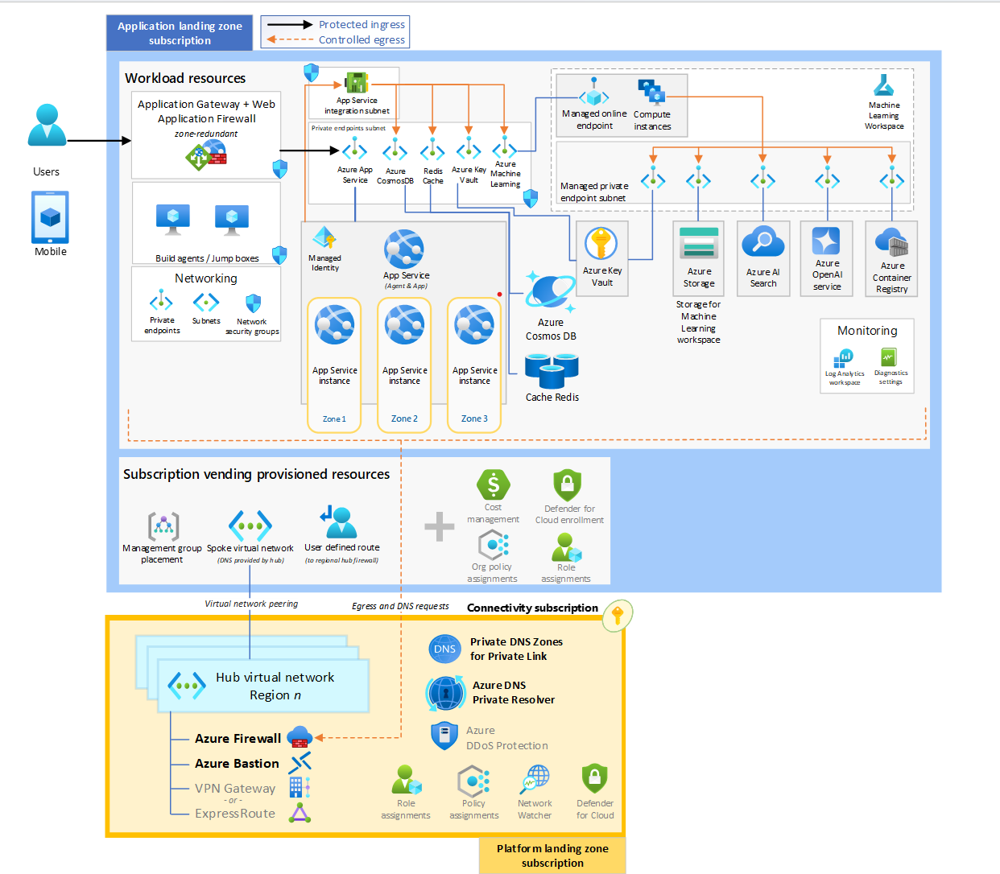

## Introduction
This section explores a system architecture for an agentic agent system that can be utilized across various agent scenarios and design patterns. The architecture encompasses software component-level design and addresses engineering considerations such as integration, scalability, security, logging, monitoring, and responsible AI.
## Agent System Architecture: Logical View

The logical view offers an overview of the agentic system in terms of its functional building blocks. These components are elaborated upon in subsequent views detailing their construction. 

The architecture's primary services include:
- **Hosted Foundation Models:** These are the key foundation models (LLM/VLM) that drive the core capabilities of the agent.  
- **AI Safety Services:** These services monitor content generated by both foundation models and humans, detecting and mitigating potential risks, threats, and quality issues.  
- **AI Services:** Off-the-shelf AI services that provide additional capabilities for the agents, such as text-to-speech, speech-to-text, and object detection.  
- **Hosted Custom AI/ML Models:** Custom machine learning and AI models that offer supplementary capabilities for the agents in scenarios where standard AI services are insufficient. For example, a custom intent classification model trained on a proprietary dataset to ensure fast and accurate intent classification.  
- **External Systems:** These are external applications and systems that agents interact with to retrieve information or execute business transactions. The interaction with external systems is facilitated through APIs with appropriate security and access controls. These systems can range from publicly accessible tools like Bing and Google search services to enterprise applications like CRM systems.  
- **Agent Orchestration Framework:** This central component is where the primary capabilities of the agents are developed. It includes:  
  - **Policy:** Defines the rules and guidelines that govern agent behavior.  
  - **Memory:** Manages the storage and retrieval of information that agents use in their reasoning processes.  
  - **Tool Calling:** Facilitates the invocation of external tools and services that the agent might need to perform specific tasks.  
  - **Code Execution Environment:** Provides a safe and controlled environment for executing code that the agent generates.  
  - **Multi-Agent Orchestration:** Coordinates the interactions and collaborations between multiple agents to achieve complex goals.  
  
- **User Experience (Text, Voice, Video):** This component handles the different modalities through which users interact with the agents, ensuring seamless user experiences across text, voice, and video interfaces.  
  
- **Application Platform:** This layer provides the foundation for building and running agent applications. It includes:  
  - **Front End:** The user interface that users interact with.  
  - **Backend:** The server-side logic that powers the agent applications.  
  - **Database:** The storage system for persisting data used by the agents and applications.  
  
- **Infrastructure Platform:** The underlying hardware and software infrastructure that supports the entire system, ensuring scalability, reliability, and performance.  

## Agent System Architecture: Component View  
  
The component view delves deeper into the technical components of each logical building block outlined in the previous section. This detailed architecture provides a clearer picture of the specific technologies and services used to implement the agent system.  

#### Cloud AI Services  
  
- **Hosted Foundation Models:**   
  - **OpenAI**, **Mistral AI**, **Meta**: Large language models (LLMs) or Vision language models (VLMs) for image and video processing that power the core capabilities of the agent. These models can be provisioned as serverless APIs or they can be provisioned with dedicated managed computes

  
- **Custom ML Models:**   
  - **Azure Machine Learning**: Platform for training and deploying custom machine learning models tailored to specific needs.  
  
- **Responsible AI:**   
  - Delivered by Azure OpenAI RAI Content Safety services.  
  
- **Azure AI Services:**   
  - A suite of pre-built AI services for various capabilities, including cognitive services and other AI functionalities.  
  
#### External Systems  
  
- **Internet Services:**  
  - **Bing**, **Google**, **SERPAPI**: External internet services for web search and information retrieval.  
  
- **Enterprise Applications:**  
  - **CRM**, **Finance**: Internal enterprise applications for customer relationship management and financial operations.  
  
- **Enterprise DB:**  
  - Centralized database for storing enterprise data.  
  
#### Agent Services  
  
- **Code Execution Service:**   
  - **App Services**, **Kubernetes Services**, **Function Apps**: Platforms for executing code generated by the agent in a secure and scalable manner.  
  
- **Agent Orchestration Service:**  
  - **Langchain**, **Autogen**, **SK**, **Promptflow**: Tools and frameworks for orchestrating agent behaviors and interactions.  
  - **App Services**, **Kubernetes Services**, **Function Apps**: Platforms supporting the orchestration service.  
  
- **Current Memory:**  
  - **Cache Redis**, **Azure Cosmos DB**: Systems for managing short-term memory and fast data access.  
  
- **Long Term Memory:**  
  - **Storage Accounts**, **AI Search**: Systems for storing and retrieving long-term data and knowledge.  
  
#### Application Services  
  
- **App Backend Services:**  
  - **App Services**, **Kubernetes Services**, **Function Apps**: Backend infrastructure supporting the agent applications.  
  
- **App Frontend Services:**  
  - **App Services**, **Kubernetes Services**, **Function Apps**: Frontend infrastructure for user interfaces.  
  
- **App Databases:**  
  - **Azure Cosmos DB**, **Azure SQL**, **Cache Redis**: Databases for storing application data.  
  
#### User Experience  
  
- **Client Applications:**  
  - **Windows**, **macOS**, **iOS**, **Android**, **Web**: Platforms for user-facing applications.  
  - **Text**, **Voice**, **Vision**: Various modalities for user interaction.  
  
- **Small Language Model:**  
  - Lightweight language models for specific tasks and localized processing.  
  
#### Supporting Services  
  
- **API Management:**  
  - Centralized management of APIs for secure and efficient communication between components.  
  
- **Network Security and Access Management:**  
  - Ensures secure access and communication across the network.  
  
- **Logging and Monitoring:**  
  - Tools and services for tracking system performance, detecting issues, and ensuring reliability.  

## Agent System Architecture: Infrastructure View  

The infrastructure view provides a detailed look at the technical infrastructure components supporting the agent system. This view highlights the various resources and services used to ensure the system's scalability, reliability, and security.  
  
#### Workload Resources  
  
- **Application Gateway + Web Application Firewall:**  
  - **Zone-redundant**: Ensures high availability and protection from web vulnerabilities.  
    
- **App Services:**  
  - **Integration Subnet**: Private endpoints for secure communication.  
  - Multiple instances across **Zone 1**, **Zone 2**, and **Zone 3** for load balancing and redundancy.  
  
- **Networking:**  
  - **Private endpoints**: Secure access to resources.  
  - **Subnets**: Segregate and secure different network segments.  
  - **Network Security Groups**: Control inbound and outbound traffic to network resources.  
  
- **Managed Identity:**  
  - Provides secure identity management for accessing Azure resources.  
  
- **Build Agents / Jump Boxes:**  
  - Dedicated resources for building and deploying applications.  
  
#### Cloud Services  
  
- **Azure Cosmos DB:**  
  - Globally distributed, multi-model database service.  
  
- **Redis Cache:**  
  - In-memory data structure store used as a cache and message broker.  
  
- **Azure Key Vault:**  
  - Securely stores and accesses secrets, keys, and certificates.  
  
- **Azure Machine Learning:**  
  - Comprehensive machine learning service for building and deploying models.  
  
- **Azure Storage:**  
  - Scalable cloud storage for data, files, and applications.  
  
- **Azure AI Search:**  
  - AI-powered cloud search service for building sophisticated search experiences.  
  
- **Azure OpenAI Service:**  
  - Provides access to OpenAI's powerful language models.  
  
- **Azure Container Registry:**  
  - Stores and manages container images for Kubernetes deployments.  
  
#### Monitoring  
  
- **Log Analytics Workspace:**  
  - Collects and analyzes log data from various sources.  
  
- **Diagnostic Settings:**  
  - Configures and collects diagnostic data for monitoring and troubleshooting.  
  
#### Subscription Vending Provisioned Resources  
  
- **Management Group Placement:**  
  - Organizes and manages subscriptions within a management group.  
  
- **Spoke Virtual Network:**  
  - DNS provided by the hub for network segmentation and security.  
  
- **User Defined Route:**  
  - Custom routes for directing network traffic.  
  
- **Cost Management:**  
  - Tools for monitoring and managing cloud costs.  
  
- **Defender for Cloud Enrollment:**  
  - Security management and threat protection for cloud resources.  
  
- **Org Policy Assignments and Role Assignments:**  
  - Ensures compliance and assigns appropriate roles and permissions.  
  
#### Connectivity Subscription  
  
- **Hub Virtual Network Region:**  
  - Centralized network hub for managing connectivity between resources.  
  
- **Azure Firewall and Azure Bastion:**  
  - Provides secure access to virtual machines and resources.  
  
- **VPN Gateway or ExpressRoute:**  
  - Establishes secure connections between on-premises networks and Azure.  
  
- **Private DNS Zones for Private Link:**  
  - Facilitates private DNS resolution for Azure services.  
  
- **Azure DNS Private Resolver:**  
  - Resolves DNS queries within a virtual network.  
  
- **Azure DDoS Protection:**  
  - Protects applications from Distributed Denial of Service (DDoS) attacks.  
  
- **Network Watcher:**  
  - Monitors and diagnoses network conditions.  
  
- **Policy Assignments and Role Assignments:**  
  - Enforces policies and assigns roles to ensure security and compliance.  
