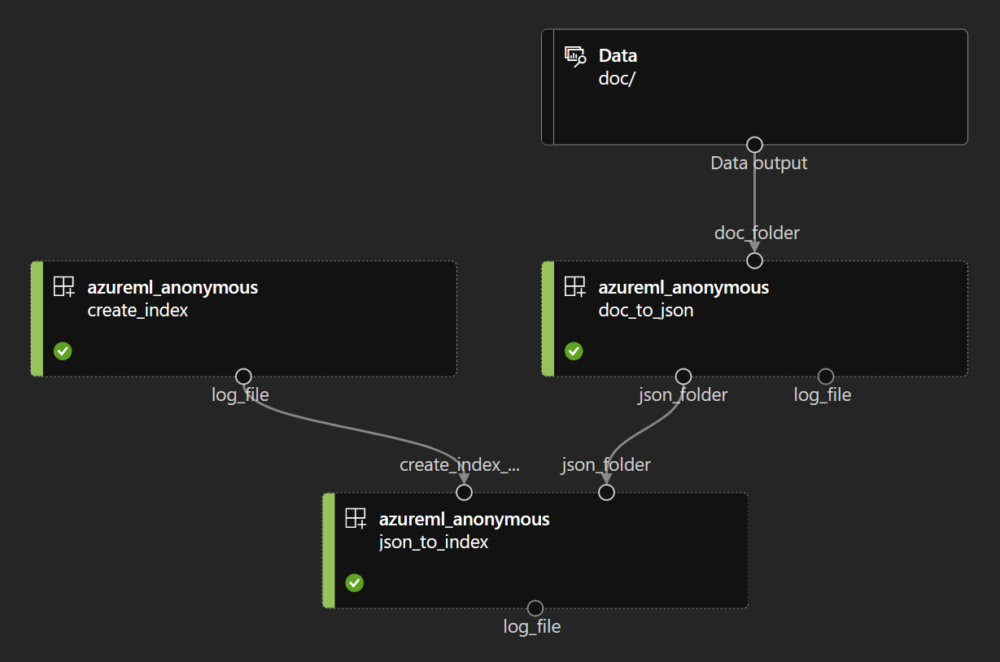

# Building a RAG agent in Azure

This repo focuses on building a simple but scalable project to deliver a RAG agent in Azure. It implements a good foundation which can be customized and made production ready with LLMOps in mind. It is minimal but outlines all the key principles and requirements for a production RAG agent. This is not intendeded to go to production as is, but as a reference starting point for a production project.

Two main parts will be outlined in this minimal project to get you started with such a project:
- data ingestion into an AI Search index, including automatic document discovery, contextual chunking and encrichment to produce rich and precise medatada to support accurate retrieval
- (upcoming) a simple RAG agent to answer questions based on the indexed documents, based on a Prompt Flow built in Azure AI

# Data Ingestion: Azure ML enrichment pipeline to index documents

## Overview

An Azure ML Pipeline will load generic documents (PDF, images, Word, PowerPoint, Excel, HTML, etc.) into an AI search index with contextual chunking and vectorization supported by the following services:
- Azure Docuemnt Intelligence
- Azure OpenAI
- Azure AI Search
- Azure Machine Learning

This is an [Azure ML CLIv2](https://learn.microsoft.com/en-us/azure/machine-learning/how-to-configure-cli?view=azureml-api-2&tabs=public) template project demonstrating the use of the parallel job type to do large scale documents processing.

We here have a simple pipeline with 2 steps:
- doc2json:
	- input: folder containing a set of documents to process
	- output: one json file per document, containing the extracted text and metadata
- create-index:
	- output: log file with the index creation status
- json2idx:
	- inputs:
	  - log_file of create-index step to introduce a dependency between the 2 steps
	  - folder of json files
	- output: a search index containing the extracted text and metadata



Each step is configured with a different level of parallelism, and could potentially use a different compute type/scale. See the control parameters for retries, timeouts, etc. in the pipeline.yml file.

For more details check [How to use parallel job in pipeline (V2)](https://learn.microsoft.com/en-us/azure/machine-learning/how-to-use-parallel-job-in-pipeline?tabs=cliv2)

## Services Setup

To run this project, you need to have an Azure subscription and the following services setup:
- Azure ML
- Azure OpenAI
- Azure AI Search

The credentials of these services are assumed to be present in the default Azure Key Vault of the Azure ML Workspace. See codebase for keys used to locate these secrets or refer to step 5. below.

The Azure ML workspace needs to have a datastore named 'datalake' created, under which a folder named 'ara-d2i/docs' should contain all the documents to be indexed. The easiest way to do this is to locate the default blobstore of your workspace, and create a new container named 'datalake' in it, and then upload the documents to the 'ara-d2i/docs' folder. Then go to AML/Data and create a new 'Datastore' which points to that container.

## Local Environment Setup

1. [Install the Azure CLI + the Azure CLI 'ml' extension](https://docs.microsoft.com/en-us/azure/machine-learning/how-to-configure-cli?tabs=public)

2. Login to your Azure subscription:
```bash
az login
```

3. Setup your azure CLI defaults to connect to your Azure ML workspace:
```bash
az configure --defaults group=<resource-group> workspace=<workspace-name> region=<region>
```

4. Rename the following file '.azureml/config.json.template' to '.azureml/config.json' and fill in the values with your environment values. This will enable the code to run locally and connect to the AML workspace to retrieve its default key vault and the necessary secrets.

5. Setup the following secrets in your Azure Key Vault:
```bash
AZURE-AI-SEARCH-ADMIN-API-KEY
AZURE-AI-SEARCH-ENDPOINT
AZURE-DOCUMENT-INTELLIGENCE-ENDPOINT
AZURE-DOCUMENT-INTELLIGENCE-KEY
AZURE-OPENAI-API-KEY
AZURE-OPENAI-API-VERSION
AZURE-OPENAI-EMBEDDING-MODEL-NAME
AZURE-OPENAI-ENDPOINT
```

## How to create and run the pipeline

Run the following commands to create the steps runtime environment (repeat this any time you need to modify the 'conda' files in each step folder to support code changes).

Create the 2 environments supporting each pipeline step (we could have used a single environment for both steps but it is best practice to have a specific runtime per task/step as they tend to eventually diverge and use different packages/versions; if these environments happened to be the same, it would be detected and would only create one backend image anyway):
```
az ml environment create -f doc2json/environment.yml
az ml environment create -f json2idx/environment.yml
```
To trigger a pipeline creation/update/run, execute the following:

```
az ml job create -f pipeline.yml
```
Then go to the Azure portal to monitor your pipeline.

At this point you have a highly scalable pipeline (*) which does basic contextual chunking of any of the document type supported by leveraging the Markdown output of the Azure Document Intelligence service, and the vectorization of the text using the OpenAI service. The output is then indexed in Azure AI Search.

(*) The serverless compute can be scale vertically and horizontally at will, and the platform will distribute the workload to index to all compute available.