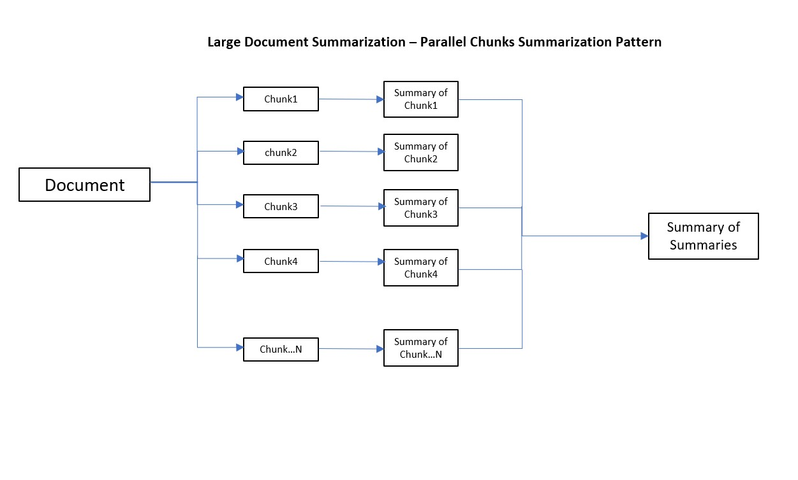

# Large Document Summarization

## Use Cases

Document Summarization can be used to summarize Call Center Log Analytics, Customer and Agent Communications, Legal Documents and Contracts, blogs, and social media feeds. Summarizing these documents drives business value in various industries including legal, retail, customer services, call center, entertainment, financial, banking and travel industries. 

## Challenges

Large Documents summarization has below Challenges

**1 -** Input text size and token limitations in GPT models 

**2-** Summarization of Summarization leads to information loss due to multiple chunks summarizations

## Solution Patterns

---
### Pattern 1: (Chunk Based Summaries with Parallel Processing)
---
#### Approach

This approach splits large documents into chunks and summarizes each chunk independently, and later the summarized chunks are summarized to get the final summary. 

#### Implementation

This pattern can be implemented to summarize large documents, and has the capability process chunks in parallel. This chunk summarization approach summarizes the document chunks independently, leading to parallel and fast execution of chunks. As you can see from the below flow, the final chunk summary is the summary of the all chunks summaries 

This pattern can be implemented using langchain library method "Map Reduce". Please refer to below GitHub repository for an example

https://github.com/microsoft/OpenAIWorkshop/blob/main/scenarios/powerapp_and_python/python/Langchain_Summarization.ipynb 

#### Performance

This approach processes the chunks in parallel, thus it is fast as compared to sequential processing pattern

#### Strengths

Faster processing time 

#### Limitations

Loss of information may be possible as each chunk is independently processed with no relation to other chunks. There may be dependencies on the ordering of the documents

---

### Pattern 2: (Chunk Based Summaries with Suquential Processing)
---
#### Approach

The Sequential chunking approach is to split large documents into chunks where each chunk is processed seuquentialy, processed chunk summary is provided as an input to next chunk 
 
#### Implementation

This pattern can be implemented to summarize large documents, and has the capability process chunks in Sequence. The Sequence chunk summarization approach summarizes the document chunks with input from previous chunk, this enables the summary to keep context of previous chunk. As you can see from the below flow, the final chunk summary will have context from all previous chunks.

The below flow provides the sequential flow where chunks can be proceesed in sequence with Open AI, each chunk is processed with summary of previous chunk

This pattern can be implemented using langchain library method "Refine".Please refer to below GitHub repository for an example

https://github.com/microsoft/OpenAIWorkshop/blob/main/scenarios/powerapp_and_python/python/Langchain_Summarization.ipynb 

#### Performance

This approach cannot process the chunks in parallel, thus it is slow as compared to parallel processing pattern

#### Strengths

The final summary will have more context of orignal document as each chunk will have the summary of previous chunk 

#### Limitations

The processing will be slow as compared to parallel chunk proceesing 

---
