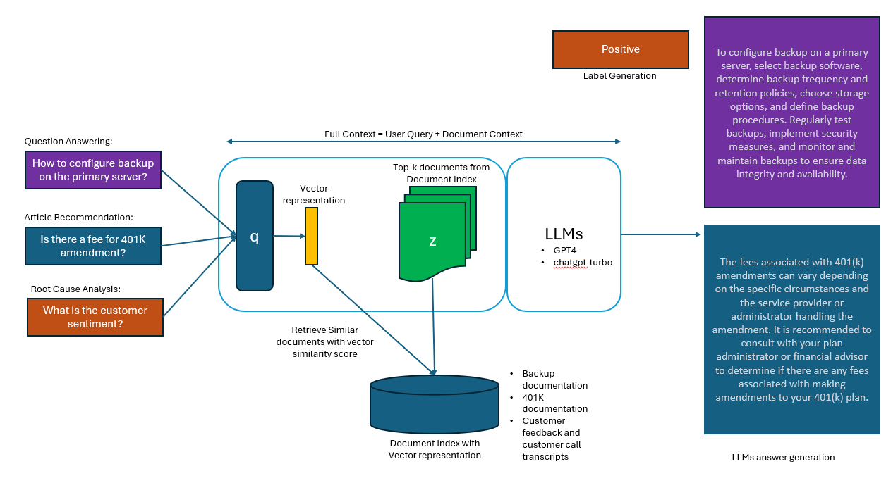

# Retrieval Augmented Generation (RAG)
LLMs can run into limitations when it comes providing  questions on recent events and updated documentation as the trained dataset would have drifted since the LLMs were last trained. With this limitation, LLMs have a tendency to "hallucinate" and provide misinformation or inaccurate output. With RAG, LLMs can generate more specific and factual output than a state of the art LLMs. 

## Generic principle of RAG

## Use Cases
LLMs can be used in many use cases listed below with RAG.

* Customer Call routing

In Customer call routing scenario, the calls can be routed to the correct department based on customer inquiry and conversation between the initial agent and customer. The customer call log that is generated using speech to text services is used to find relevant knowledge base articles using Vector similarity and the knowledge base articles are used to answer specific questions asked by the customer in the converation. This can reduce call handling time and improve customer experience due to shortned call duration and minimized repeat calls. 
* Product Copilots

Product Copilots can be built into the end user product that can provide just-in-time assistance to end users seeking to learn a new feature. The Copilot uses existing and up-to-date product documentation and can provide step-by-step guidance to end users' questions.
* Chatbot to Resolve Level1 and Level2 product support inquiries

Many enterprise products need to provide level 1 and level 2 support to customer issues. Many initial and commonly faced issues can be deflected using a ChatBot that is integrated into the product support page. The support case chatbot can also refer to knowledge base articles and provide assistance to Level 2 support Subject Matter Experts. This helps to reduce the support case handling time from weeks to few days and also results into fewer L1 support issues being handled by SMEs. 

The below architecture shows how a chatbot can be implemented in product support use cases, where the product issues are created in Oracle Case management. LLMs and Embedding models are used to find relevant cases and knowledge articles using Rest API and provide answers to end user queries and also aide SME to find relevant knowledge article and reduce the case resolution time. The LLMs are also used to generate new knowledge articles based on existing knowledge articles and resolved cases when such knowledge articles are not available.

## Key Concepts in RAG

### Document Indexing

One of the key components in making LLMs effective is to provide additional context to LLMs to answer the user query or to complete the prompt. This additional context can come from high quality documents which could be in different formats - Word documents, PDF Files, Web Pages and semi-structured files like json and flat files and also REST APIs. 

These documents can have additional structure like pages, sections, paragraphs and tables like in the case of Word and PDF documents. They might also contain metadata like authors, last modified datetime, version and tags like confidentiality, categories etc. This metadata could be used to index relevant content for e.g use the latest version or newest document. 

### Document Chunking

Document chunking is another important aspect. Because LLMs have limits on the input tokens, it would be optimal to include relevant content in the prompt that can help with prompt completion or answer user query. For e.g in the case of product documentation, if the answer to the user query lies inside page 5 of a 20-page document, it would be futile to send the entire 20 pages to the LLMs as additional context. It might not only exceed the token limits but also trip the LLMs in providing inaccurate response. 
So it is imperative to have a structured chunking approach. For e.g extract pages and chunking by paragraphs. Each chunk is then indexed into the Document Index as a separate document. The vector embeddings are also obtained on these individual chunks. 

### Choosing embedding engine

While there are many models that can provide embeddings, choosing the best model based on benchmarks can provide a strong performance in various tasks such as classification, retrieval and clustering of relevant documents from the document index while performing the vector similarity match. 

[MTEB](https://huggingface.co/spaces/mteb/leaderboard) provides a comparison for various embedding models.

### Choosing Vector Database to store embeddings

A vector database stores the vector representation of the documents generated using embedding models. A few examples of vector database include Pinecone, Weavite, Milvus, Azure Redis Enterprise and Azure Cognitive Search. Pinecone provides a hosted or Software as a Service, whereas Milvus and Weavite are opensource and can be deployed on Azure. 
Azure Cognitive Search now includes [Vector Search feature](https://github.com/Azure/cognitive-search-vector-pr) that is built into the search engine and provides a managed solution for both document index and vector index.

